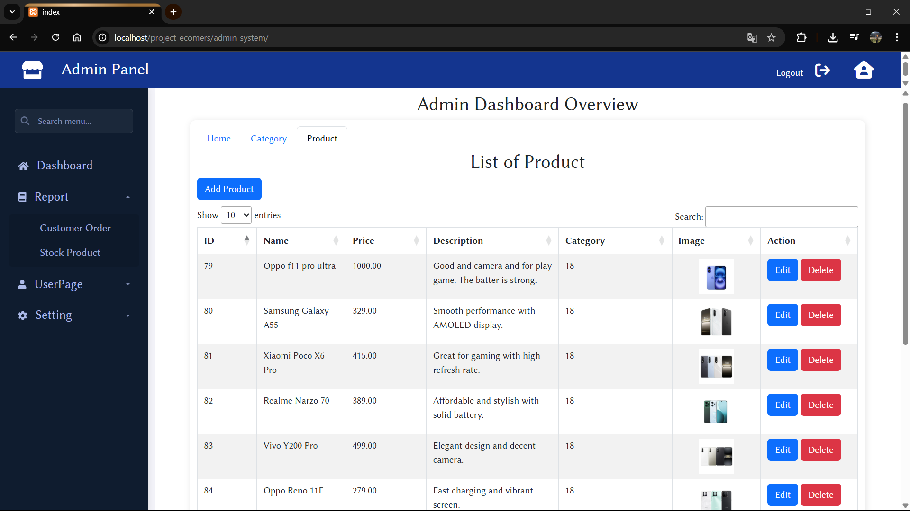
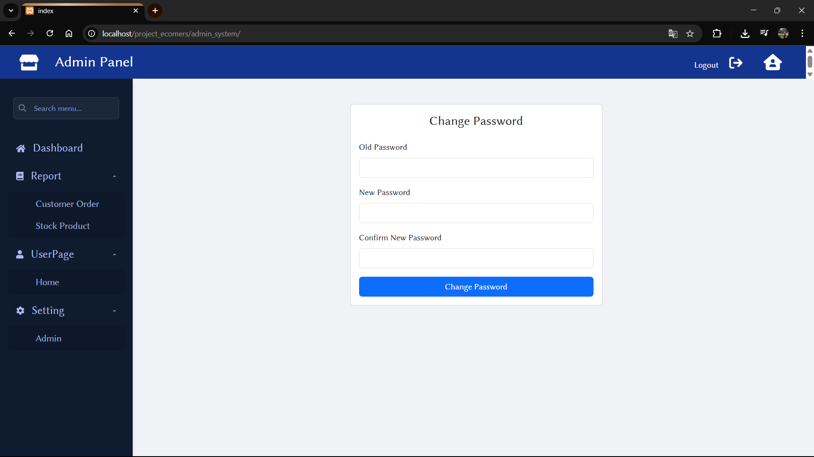

 Mini E-commerce System

A simple but functional **E-commerce web application** built with PHP, MySQL, Bootstrap, and Chart.js.  
This project allows customers to browse products, add them to a cart, place orders, and provides an **admin panel** for managing products.

 Features

Frontend (User Side)
- View product catalog with search & filter
- Add to cart and manage cart items
- Place an order and view order confirmation

Backend (Admin Panel)
- Login authentication (Admin)
- Add, edit, and delete products
- View product list with search & filter
- Dashboard with sales visualization using Chart.js

 Technologies Used
- Frontend:HTML, CSS, Bootstrap, JavaScript
- Backend: PHP 
- Database:MySQL
- Visualization: Chart.js

 Database Structure
 Tables:
1. `products` — Stores product details (name, price, description, image)
2. `category`- Store category of pruduct
3. `orders` — Stores order details
4. `order_items` — Stores products linked to each order
5. `tbl_admin` — Stores admin password for change ...

 Screenshots

 User Interface

<table>
  <tr>
    <td></td>
    <td></td>
    <td></td>
    <td></td>
  </tr>
  <tr>
    <td></td>
    <td></td>
  </tr>
</table>

Admin Panel

<table>
  <tr>
    <td></td>
    <td></td>
    <td></td>
    <td></td>
  </tr>
  <tr>
    <td></td>
    <td></td>
    <td></td>
  </tr>
</table>

